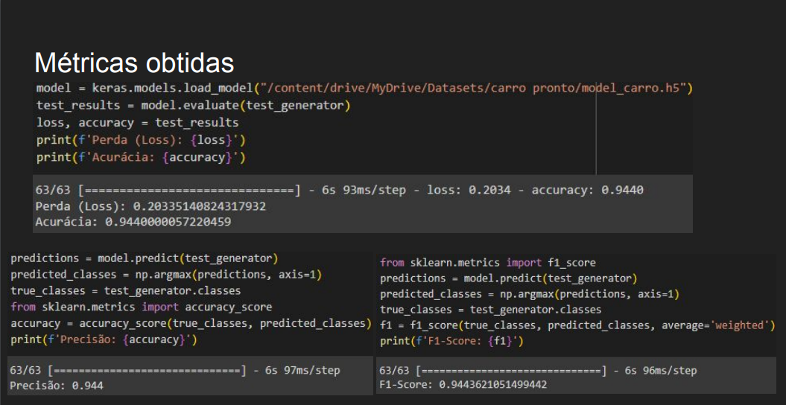

Resultados das CNN com as métricas

## RIM DATASET

Ao passar o modelo treinado pelas imagens de teste do dataset de rins foi obtido as métricas acima o resultado foi mediano devido a um problema no dataset (melhor explicado no artigo).

## CAR DATASET

Já ao passar o modelo treinado pelas imagens de teste do dataset de carros foi obtido um resultado bom, sendo limitado a isso pelo treinamento pelo colab que limitou o tempo de treinamento devido a utilização da versão gratuita
